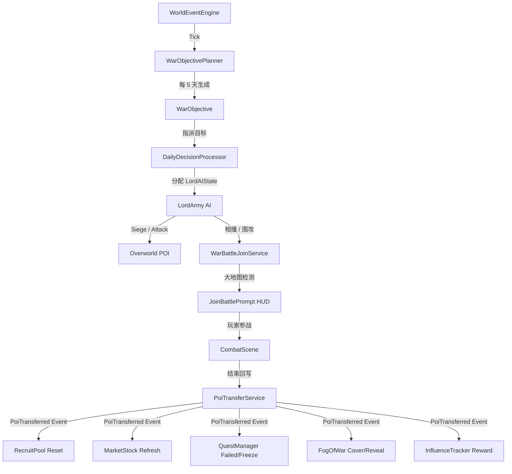

# 战争闭环 MVP 核心系统架构设计 (.limcode/design/war-system-mvp.md)

## 1. 核心目标
建立一个具备“实质大地图模拟 -> 玩家深度交互 -> 政治/外交决策 -> 世界副作用响应”的动态战争沙盒闭环。使游戏世界摆脱纸面战争，让战争过程有迹可循，玩家的行为能切实左右地缘政治与经济格局。

---

## 2. 架构拓扑与数据流 (Mermaid)

---

## 3. 核心设计细节

### A. 战争状态实质化与 AI 寻路 (Phase A)
- **WarState 字段扩展**: 支持双方战分 `WarScore` 和攻防首要/次要目标列表。
- **WarObjectivePlanner**: 每 5 天基于距离、繁荣度、防御兵力计算权重，为攻守双方生成最多 2 个 High + 3 个 Normal 攻势 POI 目标。
- **LordArmy AI 行军**: 领主在所属国家开战时，摒弃单纯的巡逻，依据距离与空闲度认领国家级 `WarObjective`。行军途中会实时检测视野内的敌方部队并进行战略拦截，或直接对目标 POI 实施长达数日的重围攻城。

### B. 玩家交互与战事介入 (Phase B)
- **稳定玩家国家解析 (`PlayerNationResolver`)**: 采用声望阈值（>= 30）结合 7 日平滑稳定窗口机制，防止因声望频繁微调导致所属国快速漂移。
- **战事中途参战**:
  - `WarBattleJoinService` 检测玩家与交战领主或围攻点的距离，提供 250px 范围的参战机会。
  - 大地图浮空 HUD 毛玻璃 Prompt 会提供“加入进攻方 / 加入防守方 / 撤离”的战术选择。
  - 战后回到大地图时，数据将由大地图实体管理器统一回写：若攻城胜利，物理层立即易手；败军进入溃退逃跑状态，并自动向所有符合在场条件的国家和盟友分发 `Influence`。
- **国家外交大厅 (`KingdomPanel`)**:
  - 玩家可在面板中消耗相应的影响力（宣战 50 影响力，媾和 80 影响力），向敌国进行地缘博弈决策。

### C. 易手副作用闭环 (Phase C)
- **招募池动态更迭 (`RecruitPool`)**: 订阅易手事件，当 POI 易手时，强行清空历史招募池，并基于占领方势力的种族数据和兵种模版重新洗牌，确保占领后第一天即可招募到新国特色兵种。
- **繁荣度与市场重构 (`MarketStock`)**:
  - 沦陷导致聚落繁荣度瞬间暴跌 30 点。
  - 市场库存将立刻全部下架，并根据新国家的贸易品体系和最新繁荣度重组货架。
- **任务冻结与宽限期 (`QuestManager`)**:
  - 原本在该聚落承接的任务状态被变更为 “PendingFailed”。
  - 引入 **3 天黄金收复期**：若玩家在 3 天内协助友军成功收复该聚落，任务即可恢复“InProgress”；如果超过 3 天，任务将永久失败。
- **战争迷雾重塑 (`FogOfWar`)**:
  - 聚落易手敌方，周边 600 像素范围的视野被彻底抹去，重盖迷雾；
  - 协助光复并占领时，周边 800 像素范围内的迷雾会被再次驱散，体现了哨塔和聚落哨所重建的视觉收益。
