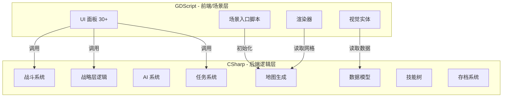

# C# 后端迁移方案

> 将大部分后端逻辑从 GDScript 迁移到 C#，解决以下核心问题：
> - AI 无法即时获取 GDScript 编译错误（C# 有 `dotnet build`）
> - 级联解析错误（一个类型找不到 → 100+ 行报错）
> - 缺乏静态类型检查（C# 编译期捕获错误）
> - 几百个警告 AI 无法获取和修复

---

## 1. 迁移策略：后端 C# + 前端 GDScript



### 1.1 保留 GDScript 的模块（约 40 个文件）

这些文件直接绑定 `.tscn` 场景或处理 UI，GDScript 更简洁：

| 类别 | 文件 | 原因 |
|------|------|------|
| UI 面板 | MainMenu, SettingsPanel, OriginSelect, LoadingScreen, OverworldUI, CombatUI, BattleLogPanel, TownPanel, TradePanel, RestPanel, SmithyPanel, RecruitPanel, TemplePanel, QuestBoardPanel, InteractionPanel, DialoguePanel, ArenaPanel, TrainingPanel, PartyPanel, TerritoryUI, TownUI, ArmyManagementUI, SkillTreeUI, CharacterDetailPanel, EnemyInfoPanel, SpellSelectionPanel, HitPreviewTooltip, MoraleBar, StatusEffectDisplay, StatusEffectIcon, TerrainTooltip, TurnOrderBar, EnemyUnitBar, QuestBoard, QuestLog, TipsDisplay, TipsData, LoadingPhaseData | 场景绑定、@onready、signal |
| 渲染器 | HexOverworldRenderer, FogOfWarRenderer, OverworldTerrain | 操作 Godot 节点树 |
| 视觉实体 | OverworldParty, OverworldEnemy, OverworldTown, QuestTargetVisual, HexCell | Node2D/Area3D 场景节点 |
| 场景入口 | CombatScene, QuickCombatScene, OverworldScene, EquipmentSystemTest, SkillTreeTest, QuestTest | _ready() 初始化 |
| 音频 | AudioManager | Autoload 单例 |
| 工具 | UIFactory, UITheme | UI 构建工具 |

### 1.2 迁移到 C# 的模块（约 95 个文件）

这些是纯逻辑模块，不直接操作场景树：

| 类别 | 文件 | 行数估算 |
|------|------|----------|
| 数据模型 | UnitData, SpellData, SkillData, StatusEffectData, ItemData, WeaponData, ArmorData, AccessoryData, MountData, ConsumableData, EquipmentAffix, TraitData, RaceData, BattleCellData, HexCellData, QuestData, GameSettings, CRExperienceTable, PrototypeData | ~3000 |
| 核心引擎 | RPGRuleEngine, SaveManager, EconomyManager, GlobalState, UnitTemplateDB, SpellShapeResolver | ~2500 |
| 战斗系统 | CombatManager, CombatResolver, SkillEffectExecutor, StatusEffectManager, MoraleSystem, SpellManager, VFXManager, EquipmentManager, EquipmentGenerator, ConsumableManager, EnemyGenerator, SkillRegistry, FacingSystem, LineOfSight, EnvironmentEventSystem, LootTable | ~5000 |
| AI 系统 | AIController, AIStrategyBase, AIStrategyCautious, AIStrategyReckless, AIStrategyTactical, AIStrategyInstinct, AITargetEvaluator, AISpatialAnalyzer, AIDifficultyConfig, AIAction | ~3000 |
| 地图生成 | HexOverworldGenerator, HexOverworldGrid, HexOverworldTile, HexOverworldAStar, HexUtils, HexLayoutConfig, BattleMapGenerator, CombatMaterialManager, HexGrid | ~4000 |
| 战略层 | WorldGenerator, OverworldEntity, OverworldPOI, OverworldAIResolver, OverworldEntityManager, FogOfWar, MovementSpeedComponent, BattleContext, DeploymentZone | ~4000 |
| 任务系统 | QuestManager, QuestEncounterData, QuestTargetSite | ~1500 |
| 技能树 | SkillTreeManager, CharacterSkillTree, ClassTitleResolver, NodeFiller, SkillTreeData, SkillNodeData, SkillTreeCoord | ~2000 |
| 交互 | InteractionManager, InteractionOption, InteractionType, NPCProfile, TownFacility | ~1500 |
| 角色 | CharacterGenerator | ~1500 |
| **总计** | **~95 个文件** | **~28000 行** |

---

## 2. 迁移执行计划

### Phase 0: 项目配置

**目标**: 在 Godot 项目中启用 C# 支持

```bash
# 1. 安装 .NET SDK 8.0
# 2. 在 Godot 编辑器中: 编辑 → 编辑器设置 → .NET → 启用
# 3. 项目 → 工具 → C# → 创建 C# 解决方案
# 这会生成:
#   Blade&Hex.csproj
#   Blade&Hex.sln
```

### Phase 1: 基础数据模型（无依赖）

**迁移顺序** — 按依赖关系从底向上：

```
Phase 1.1: 纯数据类 (extends Resource/RefCounted, 无外部依赖)
    ├── BattleCellData
    ├── HexCellData
    ├── GameSettings
    ├── CRExperienceTable
    ├── EquipmentAffix
    └── PrototypeData

Phase 1.2: 物品数据 (依赖 Phase 1.1)
    ├── ItemData
    ├── WeaponData
    ├── ArmorData
    ├── AccessoryData
    ├── MountData
    ├── ConsumableData
    ├── TraitData
    └── RaceData

Phase 1.3: 核心数据 (依赖 Phase 1.2)
    ├── UnitData
    ├── SpellData
    ├── SkillData
    ├── StatusEffectData
    ├── QuestData
    └── UnitTemplateDB
```

**Review 检查点**: `dotnet build` 零错误，所有数据类可在 C# 中实例化

### Phase 2: 六边形数学库

```
Phase 2.1: 纯数学工具
    ├── HexUtils          # 静态工具类，无依赖
    ├── HexLayoutConfig   # Resource，无依赖
    └── SkillTreeCoord    # 静态数学，无依赖

Phase 2.2: 六边形数据模型
    ├── HexOverworldTile   # 依赖 HexUtils
    ├── HexOverworldGrid   # 依赖 HexOverworldTile
    └── HexOverworldAStar  # 依赖 HexOverworldGrid

Phase 2.3: 地图生成器
    ├── HexOverworldGenerator  # 依赖 Phase 2.2 全部
    ├── BattleMapGenerator     # 依赖 HexUtils
    └── CombatMaterialManager  # 依赖 BattleCellData
```

**Review 检查点**: `dotnet build` 零错误，地图生成可从 GDScript 调用

### Phase 3: 核心规则引擎

```
Phase 3.1: 规则引擎
    ├── RPGRuleEngine      # 依赖 UnitData
    ├── SpellShapeResolver  # 依赖 HexUtils
    └── CharacterGenerator  # 依赖 RPGRuleEngine, UnitData

Phase 3.2: 存档系统
    ├── SaveManager         # 依赖 Phase 1 全部数据类
    └── EconomyManager      # 依赖 ItemData

Phase 3.3: 战斗核心
    ├── CombatResolver      # 依赖 RPGRuleEngine, UnitData
    ├── SkillEffectExecutor # 依赖 CombatResolver
    ├── StatusEffectManager # 依赖 StatusEffectData
    ├── MoraleSystem        # 依赖 UnitData
    ├── SpellManager        # 依赖 SpellData
    ├── EquipmentManager    # 依赖 EquipmentAffix
    ├── EquipmentGenerator  # 依赖 EquipmentManager
    ├── ConsumableManager   # 依赖 ConsumableData
    ├── EnemyGenerator      # 依赖 UnitTemplateDB
    ├── SkillRegistry       # 依赖 SkillData
    ├── FacingSystem        # 依赖 HexUtils
    ├── LineOfSight         # 依赖 HexUtils
    ├── EnvironmentEventSystem
    ├── VFXManager
    ├── LootTable
    └── CombatManager       # 依赖以上全部
```

**Review 检查点**: `dotnet build` 零错误，战斗可从 GDScript 场景触发

### Phase 4: AI 系统

```
Phase 4.1: AI 基础
    ├── AIAction            # 纯数据
    ├── AIDifficultyConfig  # Resource
    ├── AISpatialAnalyzer   # 静态工具
    └── AITargetEvaluator   # 依赖 UnitData

Phase 4.2: AI 策略
    ├── AIStrategyBase       # 依赖 AIAction, AITargetEvaluator
    ├── AIStrategyInstinct   # 依赖 AIStrategyBase
    ├── AIStrategyCautious   # 依赖 AIStrategyBase
    ├── AIStrategyReckless   # 依赖 AIStrategyBase
    ├── AIStrategyTactical   # 依赖 AIStrategyBase
    └── AIController         # 依赖全部 AI
```

### Phase 5: 战略层 + 任务 + 技能树

```
Phase 5.1: 战略层数据
    ├── OverworldEntity      # Resource
    ├── OverworldPOI         # Resource
    ├── BattleContext        # RefCounted
    ├── DeploymentZone       # RefCounted
    ├── MovementSpeedComponent # RefCounted
    └── FogOfWar             # RefCounted

Phase 5.2: 战略层逻辑
    ├── WorldGenerator        # 依赖 OverworldPOI, HexOverworldGrid
    ├── OverworldAIResolver   # 依赖 OverworldEntity
    └── OverworldEntityManager # 依赖全部战略层

Phase 5.3: 任务+技能树
    ├── QuestEncounterData, QuestTargetSite, QuestManager
    ├── SkillTreeData, SkillNodeData, NodeFiller
    ├── ClassTitleResolver, CharacterSkillTree, SkillTreeManager
    └── InteractionManager, InteractionOption, InteractionType, NPCProfile, TownFacility
```

---

## 3. GDScript ↔ C# 互操作规范

### 3.1 GDScript 调用 C# 的方式

```gdscript
# 方式 1: 直接调用 C# 类 (通过 class_name 注册)
var grid = HexOverworldGridCSharp.new()
grid.initialize(64, 48)

# 方式 2: 通过节点获取 C# 组件
var combat_mgr = $CombatManager  # C# 脚本挂载的节点

# 方式 3: 通过 Autoload
var save_mgr = get_node("/root/SaveManager")
```

### 3.2 C# 调用 GDScript 的方式

```csharp
// 方式 1: CallDeferred / Call
var result = GetNode<GodotObject>("UIPanel").Call("show_battle_log", message);

// 方式 2: 通过 Signal
GetNode<GodotObject>("CombatUI").EmitSignal("battle_started");
```

### 3.3 数据传递规范

```
GDScript → C# 传递:
    基础类型 (int, float, bool, String) → 直接传递
    Vector2i, Vector2, Vector3 → 直接传递
    自定义对象 → 通过 Dictionary 序列化传递
    
C# → GDScript 返回:
    基础类型 → 直接返回
    自定义对象 → 通过 Godot.Collections.Dictionary 返回
    数组 → 通过 Godot.Collections.Array 返回
```

### 3.4 命名规范

```
C# 类名: PascalCase (HexOverworldGrid)
C# 方法: PascalCase (FindPath)
GDScript 调用 C# 方法时自动转为 snake_case (find_path)
C# 文件放在: src/core/xxx/ 目录下 (与 GDScript 同目录)
C# 命名空间: BladeHex.Data, BladeHex.Combat, BladeHex.Map, etc.
```

---

## 4. 项目目录结构（迁移后）

```
Blade&Hex/
├── Blade&Hex.csproj          ★ 新增
├── Blade&Hex.sln             ★ 新增
├── project.godot
├── src/
│   ├── core/
│   │   ├── data/
│   │   │   ├── UnitData.cs           ★ C# 替代 .gd
│   │   │   ├── SpellData.cs          ★
│   │   │   ├── RPGRuleEngine.cs      ★
│   │   │   └── ...
│   │   ├── combat/
│   │   │   ├── CombatManager.cs      ★
│   │   │   ├── CombatResolver.cs     ★
│   │   │   └── ...
│   │   ├── ai/
│   │   │   ├── AIController.cs       ★
│   │   │   └── ...
│   │   ├── map/
│   │   │   ├── HexOverworldGenerator.cs  ★
│   │   │   ├── HexOverworldTile.cs       ★
│   │   │   ├── HexOverworldRenderer.gd   (保留 GDScript)
│   │   │   └── ...
│   │   ├── strategic/
│   │   │   ├── WorldGenerator.cs      ★
│   │   │   ├── OverworldParty.gd      (保留 GDScript, 调用 C#)
│   │   │   └── ...
│   │   └── ...
│   ├── ui/
│   │   ├── CombatUI.gd               (保留 GDScript)
│   │   └── ...
│   └── scenes/
│       ├── CombatScene.gd            (保留 GDScript, 薄包装层)
│       └── ...
```

---

## 5. 迁移后的工作流改进

### 迁移前 (GDScript)
```
AI 修改代码 → 用户手动打开 Godot → 运行 → 看到报错 → 复制给 AI → AI 修复 → 循环
```

### 迁移后 (C#)
```
AI 修改代码 → AI 运行 dotnet build → 立即获取所有编译错误 → AI 自行修复 → 循环直到零错误
```

**关键命令**:
```bash
# AI 可直接执行，无需打开 Godot
cd Blade&Hex && dotnet build 2>&1
# 输出所有错误和警告，精确到行号
```

---

## 6. 风险与缓解

| 风险 | 缓解措施 |
|------|----------|
| .NET SDK 安装 | 用户需安装 .NET 8.0 SDK + Godot .NET 版本 |
| .tscn 中引用的 .gd 脚本需更新 | 场景绑定脚本保留 GDScript，通过调用 C# 桥接 |
| GDScript class_name 与 C# 类名冲突 | 迁移一个删除一个，不同时存在 |
| 存档格式兼容 | C# 版本重新定义 serialize/deserialize，旧存档需迁移 |
| 互操作调试困难 | 限制跨语言调用点，用接口层隔离 |

---

## 7. 前置条件

在开始迁移前，需要确认：

- [ ] Godot .NET 版本已安装（非纯 GDScript 版本）
- [ ] .NET 8.0 SDK 已安装
- [ ] `dotnet build` 在项目目录可以运行
- [ ] Godot 编辑器中 C# 项目已创建（.csproj + .sln）
