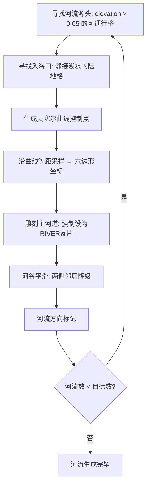
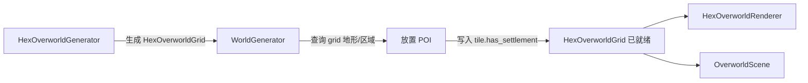
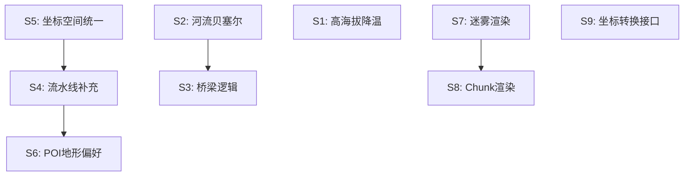

# 战略大地图程序化生成 — 补充方案

> 本文档是对 `overworld_generation_design.md` 的补充，针对现有代码与设计之间的差距，提供详细的实现方案和接口规范。

---

## 0. 修订总览

经过代码审计，发现以下核心差距需要补充方案：

| 编号 | 差距 | 严重程度 | 涉及模块 |
|------|------|----------|----------|
| S1 | 温度图缺少高海拔降温 | 中 | 基础物理层 |
| S2 | 河流系统偏离贝塞尔设计 | 高 | 水系生成 |
| S3 | 道路缺少桥梁逻辑 | 高 | 交通网络 |
| S4 | 生成流水线缺少 POI/巢穴步骤 | 高 | 执行管线 |
| S5 | WorldGenerator 与 HexOverworldGenerator 坐标空间未统一 | 高 | 架构整合 |
| S6 | POI 放置不考虑地形偏好 | 中 | POI 分布 |
| S7 | 迷雾渲染完全缺失 | 中 | 渲染层 |
| S8 | Chunk 渲染被禁用 | 低 | 渲染性能 |
| S9 | 大地图↔战斗地图坐标转换接口未定义 | 中 | 跨层接口 |

---

## S1. 温度图高海拔降温

### 问题

当前 `_generate_base_layers()` 中温度计算公式为：

```
temperature = latitude_factor + temp_noise * 0.2
```

仅考虑了纬度（r 坐标），未叠加高程降温效果。设计文档明确要求"高海拔地区会自动降低温度"。

### 方案

在计算温度时，叠加高程降温因子：

```
# 修正后的温度计算
var base_temp := latitude_factor + temp_noise           # 纬度基础温度
var altitude_penalty := clamp(elev - 0.5, 0.0, 0.5) * 0.6  # 高程>0.5时开始降温
temperature = clampf(base_temp - altitude_penalty, 0.0, 1.0)
```

**降温参数说明：**

| 参数 | 值 | 含义 |
|------|-----|------|
| 降温起点 | elevation = 0.5 | 丘陵以上开始降温 |
| 最大降温幅度 | 0.3 (0.5 × 0.6) | 最高峰温度降低30% |
| 影响范围 | elevation 0.5 → 1.0 | 覆盖丘陵到雪山 |

**注意：** 温度图必须在高程图之后计算，因为温度依赖于高程数据。当前流水线顺序已是如此，无需调整。

---

## S2. 河流系统重写 — 贝塞尔地形雕刻

### 问题

当前河流生成使用 `find_lowest_elevation_path()` A* 寻路，产生的河流路径：
- 形状不规则，缺乏艺术美感
- 没有河谷雕刻（不降低路径及两侧的高程）
- 没有"劈"出峡谷的视觉效果

### 方案：贝塞尔地形雕刻算法

#### 2.1 算法流程



#### 2.2 贝塞尔曲线生成

```gdscript
# 三次贝塞尔曲线求值
func _cubic_bezier(p0: Vector2, p1: Vector2, p2: Vector2, p3: Vector2, t: float) -> Vector2:
    var u := 1.0 - t
    return u * u * u * p0 + 3.0 * u * u * t * p1 + 3.0 * u * t * t * p2 + t * t * t * p3

# 生成一条河流的贝塞尔路径
func _generate_bezier_river_path(source: Vector2i, mouth: Vector2i) -> Array[Vector2i]:
    # 归一化到浮点空间
    var p0 := Vector2(float(source.x), float(source.y))
    var p3 := Vector2(float(mouth.x), float(mouth.y))
    
    # 生成1-2个随机横向偏移的控制点
    var mid1 := p0.lerp(p3, 0.33) + Vector2(randf_range(-8, 8), randf_range(-4, 4))
    var mid2 := p0.lerp(p3, 0.66) + Vector2(randf_range(-8, 8), randf_range(-4, 4))
    
    # 沿曲线采样 (采样间隔 0.5 格)
    var path: Array[Vector2i] = []
    var total_length := source.distance_to(mouth)  # 近似长度
    var steps := int(total_length * 2.0) + 4
    
    for i in range(steps + 1):
        var t := float(i) / float(steps)
        var point := _cubic_bezier(p0, mid1, mid2, p3, t)
        var coord := HexOverworldTile.axial_round(point.x, point.y)
        if not path.has(coord):
            path.append(coord)
    
    return path
```

#### 2.3 河谷雕刻规则

```
对河流路径上的每个瓦片 P:
    1. P 本身:
       - terrain = RIVER
       - elevation = max(0.15, P.elevation - 0.25)  # 强制降低
    
    2. P 的6个邻居 N:
       - 如果 N 不是水域/河流:
         - 如果 N.elevation > 0.60 → 降低 0.15 (山脉→丘陵)
         - 如果 N.elevation > 0.45 → 降低 0.08 (丘陵→平原)
       - 河谷平滑概率 70% (避免所有河流都一样宽)
    
    3. P 的次级邻居 (距离2):
       - 微调 elevation ±0.02 (渐变过渡)
```

#### 2.4 河流源头/入海口选择策略

```
源头选择:
    - 优先选择 elevation > 0.70 的瓦片
    - 确保源头之间距离 > 15 格 (避免河流扎堆)
    - 记录已用源头坐标，防止重复

入海口选择:
    - 找到邻接浅水的陆地格
    - 入海口与源头的直线距离 > RIVER_MIN_LENGTH
    - 优先选择离源头最远的入海口 (河流横贯大陆)
```

#### 2.5 新增常量

```gdscript
## 贝塞尔河流参数
const BEZIER_SAMPLE_DENSITY: float = 2.0     # 每格采样点数
const BEZIER_LATERAL_OFFSET: float = 8.0     # 控制点最大横向偏移(格数)
const VALLEY_CARVE_PRIMARY: float = 0.25     # 主河道高程降低量
const VALLEY_CARVE_NEIGHBOR: float = 0.15    # 邻居高程降低量(高海拔)
const VALLEY_CARVE_SECONDARY: float = 0.08   # 邻居高程降低量(中海拔)
const VALLEY_SMOOTH_PROBABILITY: float = 0.7 # 河谷平滑概率
const MIN_SOURCE_DISTANCE: int = 15          # 源头间最小距离
```

---

## S3. 道路桥梁逻辑

### 问题

当前道路生成 `_generate_roads()` 遇到河流时直接跳过（不在河流上铺路），导致道路可能绕远路或断裂。设计文档要求"遇到河流时产生高昂代价（模拟造桥），跨过后标记为桥梁瓦片"。

### 方案

#### 3.1 新增桥梁瓦片标记

在 `HexOverworldTile` 中新增字段：

```gdscript
## 桥梁标记
var is_bridge: bool = false                  # 是否为桥梁瓦片
var bridge_directions: int = 0               # 桥梁方向位掩码
```

#### 3.2 道路寻路代价修改

在 `_apply_road_cost_modifier()` 中增加河流代价：

```gdscript
# 河流代价 (模拟造桥)
if t.is_river:
    cost = 12.0    # 高昂代价但可通过 (原来被跳过)
```

#### 3.3 桥梁标记逻辑

在 `_mark_road_path()` 中增加桥梁处理：

```
对道路路径上的每个瓦片 P:
    如果 P.is_river:
        - P.is_bridge = true
        - P.is_road = true
        - P.is_passable = true
        - P.move_cost = 0.5  (同道路)
        - 不改变 P 的 terrain 类型 (仍然显示水面)
        - 标记桥梁方向位
```

#### 3.4 渲染层叠加

桥梁在渲染时作为叠加层处理：
- 底层：水面纹理
- 叠加层：桥梁纹理（可复用 `bridge_0.png`）
- 桥梁纹理方向由 `bridge_directions` 决定

---

## S4. 生成流水线补充

### 问题

当前 `HexOverworldGenerator.generate()` 的流水线缺少 POI 放置和巢穴放置步骤。`WorldGenerator` 独立于 `HexOverworldGenerator` 运行，使用互不兼容的坐标系。

### 方案：统一生成流水线

#### 4.1 修正后的完整流水线

```gdscript
func generate(width, height, world_seed) -> HexOverworldGrid:
    # 第0步: 初始化噪声
    _init_noise()

    # 第1步: 创建空网格
    grid = HexOverworldGrid.new()
    grid.initialize(width, height)
    grid.seed_value = seed

    # 第2步: 基础物理层 (高程 → 温度 → 湿度)
    _generate_base_layers(width, height)

    # 第3步: 生物群落规则 → 地形类型
    _assign_biome_terrains(width, height)

    # 第4步: 地形平滑
    _smooth_terrain(SMOOTH_PASSES)

    # 第5步: 海岸线修正
    _fix_coastlines()

    # 第6步: 贝塞尔河流雕刻
    _carve_bezier_rivers()

    # 第7步: 地理区域定义
    _define_regions(width, height)
    _assign_region_names()

    # 第8步: 聚落放置 ★ 新增
    _place_settlements()

    # 第9步: 道路生成 (连接已放置的城镇) ★ 修正顺序
    _build_roads()

    # 第10步: 隐秘巢穴放置 ★ 新增
    _place_dungeons_and_lairs()

    # 第11步: 后处理
    _finalize_terrain()

    return grid
```

#### 4.2 聚落放置规范 `_place_settlements()`

```
输入: 已生成完毕的 HexOverworldGrid (含地形、河流、区域)
输出: 在 grid 上标记 has_settlement 的瓦片

放置规则:
    城镇 (TOWN):
        - 数量: 3-4 个
        - 区域: 中央平原
        - 地形偏好: PLAINS / GRASSLAND / SAVANNA
        - 必须可通行
        - 邻近河流优先 (距离 ≤ 3 格)
        - 城镇间距离 > 10 格
        - 邻近道路优先 (放置在道路后重跑)

    村庄 (VILLAGE):
        - 数量: 8-12 个
        - 区域: 中央平原 + 银叶森林边缘
        - 地形偏好: PLAINS / GRASSLAND
        - 必须可通行
        - 村庄间距离 > 6 格

    城堡 (CASTLE):
        - 数量: 1-2 个
        - 区域: 中央平原边缘 / 区域交界处
        - 地形偏好: HILLS (扼守丘陵)
        - 必须可通行
        - 邻近道路

    精灵城镇:
        - 世界树庭: 银叶森林深处, FOREST / DENSE_FOREST
        - 月影哨站: 银叶森林东缘

    矮人城镇:
        - 铁炉堡: 霜冠山脉, HILLS / MOUNTAIN边缘
        - 霜塔堡: 霜冠山脉南麓
```

#### 4.3 道路生成修正 `_build_roads()`

当前道路使用区域中心作为路点，修正为使用已放置的定居点：

```
路点来源:
    - 所有 has_settlement == true 的瓦片坐标
    - 不再使用虚拟区域中心

连接策略:
    - 从每个城镇出发，用 Dijkstra 连接距离最近的 2-3 个其他定居点
    - 安全区域 (danger_level < 0.5) 的定居点之间才修路
    - 危险区域的巢穴不连接道路

桥梁:
    - 道路穿越河流时产生桥梁 (见 S3)
```

#### 4.4 隐秘巢穴放置 `_place_dungeons_and_lairs()`

```
输入: 已放置聚落和道路的 HexOverworldGrid
输出: 标记巢穴 POI 的瓦片

放置规则:
    哥布林营地:
        - 地形: FOREST 边缘 / SWAMP
        - 区域: 银叶森林 / 蛮荒沼泽
        - 与最近城镇距离 > 8 格
        - 数量: 3-5

    狗头人矿坑:
        - 地形: HILLS / MOUNTAIN 边缘
        - 区域: 霜冠山脉
        - 与最近城镇距离 > 10 格
        - 数量: 2-3

    牛头人石堡:
        - 地形: SAND / WASTELAND / SAVANNA
        - 区域: 焦土荒原
        - 数量: 1-2

    暗影教团据点:
        - 地形: 不限 (偏远即可)
        - 区域: 焦土荒原 / 蛮荒沼泽
        - 与任何城镇距离 > 15 格
        - 数量: 1

    龙巢:
        - 地形: MOUNTAIN_SNOW (必须是雪山)
        - 区域: 霜冠山脉
        - elevation > 0.80
        - 与任何城镇距离 > 12 格
        - 数量: 1-2

    墓穴/遗迹:
        - 地形: WASTELAND / SWAMP / ROCKY
        - 与最近城镇距离 > 8 格
        - 不在道路上
        - 数量: 3-5 (70%概率各生成一个)
```

---

## S5. WorldGenerator 与 HexOverworldGenerator 架构整合

### 问题

当前存在两套独立的生成系统：

1. **HexOverworldGenerator** — 基于 Axial 六边形坐标，生成地形+河流+道路
2. **WorldGenerator** — 基于像素坐标 (6144×4096)，用噪声范围+矩形区域放置 POI

两者坐标系不兼容，且 WorldGenerator 不查询 HexOverworldGrid 的实际地形。

### 方案：WorldGenerator 改为 HexOverworldGenerator 的下游消费者



#### 5.1 WorldGenerator 接口重构

```gdscript
# 旧接口 (基于像素噪声)
func generate(mapnoise: FastNoiseLite) -> Dictionary

# 新接口 (基于六边形网格)
func generate_from_grid(hex_grid: HexOverworldGrid, hex_generator: HexOverworldGenerator) -> Dictionary
```

#### 5.2 坐标转换

WorldGenerator 的 POI 位置从 `Vector2(px, py)` 改为 `Vector2i(q, r)`：

```gdscript
# 旧: poi.position = Vector2(px, py)         # 像素坐标
# 新: poi.hex_coord = Vector2i(q, r)          # 轴向坐标
#     poi.position = HexOverworldTile.axial_to_pixel(q, r)  # 兼容旧代码
```

#### 5.3 地形查询替代噪声查询

```gdscript
# 旧: noise.get_noise_2d(px, py) < -0.25  # 判断是否水域
# 新: hex_grid.get_tile(q, r).is_passable  # 直接查询可通行性

# 旧: get_region_at(px, py, noise_val)     # 矩形区域匹配
# 新: hex_grid.get_tile(q, r).region_name   # 直接读取区域名
```

#### 5.4 迁移步骤

1. **Phase A**: 为 `OverworldPOI` 增加 `hex_coord: Vector2i` 字段
2. **Phase B**: WorldGenerator 新增 `generate_from_grid()` 方法
3. **Phase C**: `OverworldScene.gd` 调用链改为 `HexOverworldGenerator.generate()` → `WorldGenerator.generate_from_grid()`
4. **Phase D**: 保留旧 `generate()` 作为后备（地图编辑器 JSON 导入仍需像素坐标）

---

## S6. POI 放置地形偏好

### 方案：地形匹配评分系统

```gdscript
# POI 类型的地形偏好表
const POI_TERRAIN_PREFERENCE := {
    "town": {
        TerrainType.PLAINS: 1.0,
        TerrainType.GRASSLAND: 0.9,
        TerrainType.SAVANNA: 0.6,
        TerrainType.HILLS: 0.3,
        "_default": 0.0,
    },
    "village": {
        TerrainType.PLAINS: 1.0,
        TerrainType.GRASSLAND: 0.9,
        TerrainType.FOREST: 0.3,     # 森林边缘村庄
        "_default": 0.0,
    },
    "castle": {
        TerrainType.HILLS: 1.0,      # 要塞偏好丘陵
        TerrainType.PLAINS: 0.4,
        "_default": 0.0,
    },
    "goblin_camp": {
        TerrainType.FOREST: 0.8,     # 森林边缘
        TerrainType.SWAMP: 0.7,
        "_default": 0.1,
    },
    "dragon_lair": {
        TerrainType.MOUNTAIN_SNOW: 1.0,  # 仅雪山
        TerrainType.MOUNTAIN: 0.5,
        "_default": 0.0,
    },
    # ... 其他类型
}

# 近河流加分
const RIVER_PROXIMITY_BONUS := 0.2   # 距河流 ≤ 3 格时加分
const ROAD_PROXIMITY_BONUS := 0.15   # 距道路 ≤ 2 格时加分
```

#### 放置算法

```
对每个候选位置 (q, r):
    score = terrain_preference[poi_type][tile.terrain]
    
    if 河流在3格内: score += RIVER_PROXIMITY_BONUS
    if 道路在2格内: score += ROAD_PROXIMITY_BONUS
    
    if 已有定居点在最小距离内: score = 0
    
    选择 score 最高的候选位置
```

---

## S7. 迷雾渲染

### 问题

`HexOverworldTile.visibility` 字段已定义（0=未探索, 1=已探索, 2=当前可见），但 `HexOverworldRenderer` 没有任何迷雾渲染逻辑。

### 方案

#### 7.1 迷雾层级

```
渲染层级 (z_index):
    0: 地形底图 (始终绘制)
    1: 叠加层 (道路/河流/定居点)
    2: 迷雾覆盖层
       - 未探索 (visibility=0): 深色遮罩 + 神话纹理
       - 已探索 (visibility=1): 半透明灰色遮罩
       - 当前可见 (visibility=2): 无遮罩 (完全透明)
```

#### 7.2 实现方案

在 `_render_tile_into()` 中为每个瓦片添加迷雾 ColorRect：

```gdscript
# 迷雾覆盖
var fog_rect := ColorRect.new()
fog_rect.size = Vector2(_tex_hex_w, _tex_hex_h) * 0.8
fog_rect.position = world_pos - fog_rect.size * 0.5

match tile.visibility:
    0:  # 未探索
        fog_rect.color = Color(0.05, 0.05, 0.1, 0.92)  # 深色遮罩
        # 叠加神话纹理 (可选，用精灵替代)
    1:  # 已探索
        fog_rect.color = Color(0.1, 0.1, 0.15, 0.45)   # 半透明灰色
    2:  # 当前可见
        fog_rect.color = Color.TRANSPARENT               # 无遮罩

fog_rect.z_index = 2
parent.add_child(fog_rect)
```

#### 7.3 迷雾更新触发

```
触发时机:
    - 玩家队伍移动时: 更新队伍视野范围内的瓦片 visibility = 2
    - 队伍离开后: 上一帧可见的瓦片 visibility = 1 (已探索)
    - 初始已知区域: 按出身种族设置出生地附近的 visibility = 1
```

#### 7.4 神话贴图方案

```
资源:
    未探索区域显示手绘风格的神话生物插画 (对应 04-战略层系统.md 第386行)
    可制作 3-5 张 313x313 的神话贴图:
        - 海蛇 (覆盖水域)
        - 巨龙 (覆盖山脉)
        - 奇美拉 (覆盖平原)
        - 幽灵 (覆盖沼泽)
        - 远古魔像 (覆盖荒原)
    
    按地形类型随机分配，用确定性哈希选择变体
```

---

## S8. Chunk 渲染启用

### 问题

`HexOverworldRenderer._process()` 被禁用（第354行注释 "chunk 系统暂时禁用"），当前一次性渲染全部瓦片（64×48=3072 个 Polygon2D 节点）。

### 方案

#### 8.1 启用条件

当前地图 64×48=3072 个瓦片，每个瓦片包含底图+可能的叠加层+迷雾 ≈ 3-4 个节点，总计约 10000 个节点。这在 PC 端可接受，但未来若地图扩大（如 128×96=12288），需要 Chunk 系统。

#### 8.2 Chunk 启用策略

```
Phase 1 (当前): 
    - 保持全量渲染 (3072 瓦片，性能可接受)
    - 确保 _render_all_tiles() 正确工作
    
Phase 2 (地图扩展时):
    - 启用 _process() 中的 chunk 更新
    - 每个 chunk 8×8=64 瓦片，视口通常同时可见 4-9 个 chunk
    - 卸载视口外的 chunk (queue_free)
    
Phase 3 (优化):
    - 合并同一 chunk 内的 Polygon2D 为单个 Mesh
    - 使用 TileMapLayer 替代手动 Polygon2D
```

---

## S9. 大地图 ↔ 战斗地图坐标转换

### 问题

战斗层使用 `HexUtils` (SIZE=96)，大地图使用 `HexOverworldTile` (HEX_SIZE=156)，两层之间没有坐标转换接口。

### 方案

#### 9.1 转换接口

```gdscript
# OverworldMapBridge.gd — 跨层坐标桥接工具
class_name OverworldMapBridge
extends RefCounted

## 大地图瓦片 → 战斗地图偏移
## 大地图上一个六边形 = 战斗地图上的一个区域 (约 12×10 格)
static func overworld_tile_to_battle_origin(hex_tile: HexOverworldTile) -> Vector2i:
    # 大地图瓦片的像素中心作为战斗地图的参考原点
    var px := hex_tile.pixel_pos
    # 战斗地图中心对齐 (战斗地图 12×10 格)
    var battle_origin_q := int(px.x / (HexUtils.SIZE * 1.5))
    var battle_origin_r := int(px.y / (HexUtils.SIZE * sqrt(3)))
    return Vector2i(battle_origin_q, battle_origin_r)

## 大地图地形类型 → 战斗地图地形偏好
static func overworld_terrain_to_battle(overworld_terrain: int) -> String:
    match overworld_terrain:
        HexOverworldTile.TerrainType.FOREST, \
        HexOverworldTile.TerrainType.DENSE_FOREST:
            return "forest"
        HexOverworldTile.TerrainType.SNOW, \
        HexOverworldTile.TerrainType.ICE:
            return "snow"
        HexOverworldTile.TerrainType.SWAMP:
            return "swamp"
        HexOverworldTile.TerrainType.SAND, \
        HexOverworldTile.TerrainType.WASTELAND:
            return "desert"
        HexOverworldTile.TerrainType.HILLS:
            return "hills"
        _:
            return "plains"
```

#### 9.2 战斗地图生成参数传递

```
当大地图上发生遭遇战时:
    1. 获取当前大地图瓦片的 terrain / region_name
    2. OverworldMapBridge.overworld_terrain_to_battle(terrain) → 战斗地图主题
    3. BattleMapGenerator.generate(theme, enemy_composition) → 战斗地图
    4. 战斗结束后返回大地图
```

---

## 实施优先级总表

| 优先级 | 编号 | 任务 | 前置依赖 |
|--------|------|------|----------|
| P0 | S5 | WorldGenerator 坐标空间统一 | 无 |
| P0 | S4 | 生成流水线补充 (POI + 巢穴) | S5 |
| P0 | S2 | 河流贝塞尔重写 | 无 |
| P1 | S1 | 温度高海拔降温 | 无 |
| P1 | S6 | POI 地形偏好评分 | S4, S5 |
| P1 | S3 | 道路桥梁逻辑 | S2 |
| P2 | S7 | 迷雾渲染 | 无 |
| P2 | S9 | 大地图↔战斗地图转换接口 | 无 |
| P3 | S8 | Chunk 渲染启用 | S7 |


